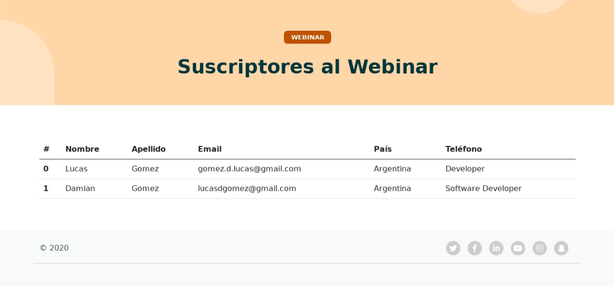

# HighTelecom Event - Subscription Site 
###  8Agency’s technical challenge

 
 [](https://www.javascript.com/) [](https://www.nodejs.org/) [](https://www.python.org/)

Live Version: https://telecomevento.herokuapp.com/


The site allows to the user to subcribe to a Webinar.
The form provided in the web asks for certain information where the User Email is unique. The Front End of the App is built with HTML/CSS/Javascript while the BackEnd is built with NodeJs (express Framework) and MongoDB as a Database(Mongoose Framework). Once the user is registered, his info is saved in the Database and in the LocalStorage with the rest of the attendees.  Also if you access to the Route https://telecomevento.herokuapp.com/subscriptor.html you will find a table with all the subscriptors to the Event. 


## Screens





## Getting Started
Follow these instructions, to get a copy and run on your PC

1- Clone this repository
2- As you can see, there are 2 main folders, one for the Front End (Client) and  another one for the BackEnd(Server)

## BackEnd: Run the Server 
3- Inside the Server Folder, you will find the package.json file with dependencies that you need to run the Server. In the command Line of your IDE/OS go to the Server folder and run

   ```
   npm install
   ```


4- You will also need to set a Database. I used Mongo with Mongoose. Learn more about it in https://www.mongodb.com/ After creating the database You will need to change the credentials and modify the name of .env.example to .env. Don´t forget to write the url of your database in the index.js folder.

5-  Finally run 
   ```
   npm run start
   ```
and the server will be ready and running.


## FrontEnd: 
6- Go to the Client folder in the directory and, as you have done previously, run 
  ```
   npm install
   ```
   to download all the dependencies that the application needs to work properly. 

7-  In the localStorageSubscriptor.js, getDataFromUser.js and app2.js you have to swap the Url of my Server to the one you have already declared. 

8- Take into consideration that the app was adapted to Run in Heroku trough coding few lines in PHP. You still can run the Site in that way or change the name of the home.html to index.html and delete the index.php and composer.js files.  

9- Finally to run the web aplicacion for the front end side I installed live-server, very easy to use and efficient, you just need to type in the command line
  ```
live-server
   ```

10- Web app running! 